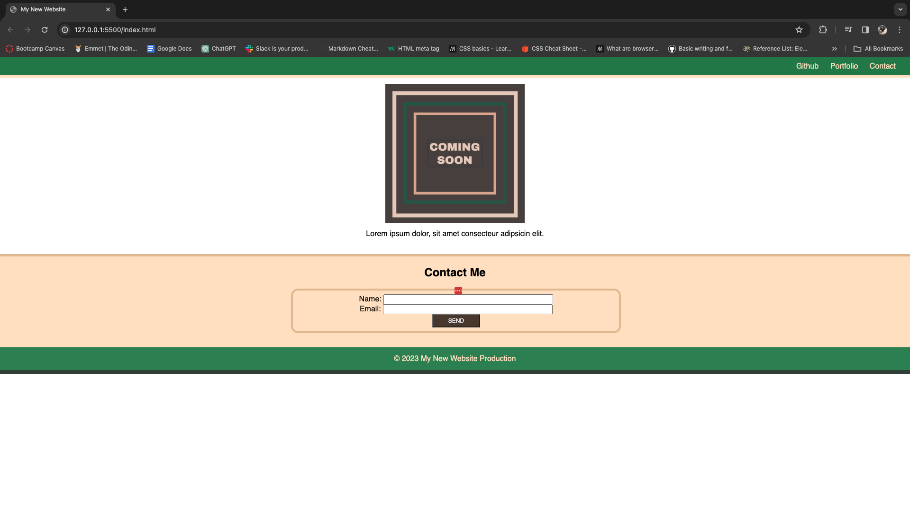

# Stu-mini-project

## Description
This is a student mini project to build a contact page using HTML and CSS.

Here is a link to the page : [Click here to go the page](https://jujunakarmi.github.io/Stu-mini-project/)

Here is a screenshot of the page:

## Usage
To use this website, there is a navigation bar on the top right corner which will lead you
in the corresponding page if you click in it. In the main content there is picture. And 
just below that there is form that requires *Name and Email* and just below that there is
**SEND** button to send the information.

## License
&copy; Copyright 2024 Juju Nakarmi